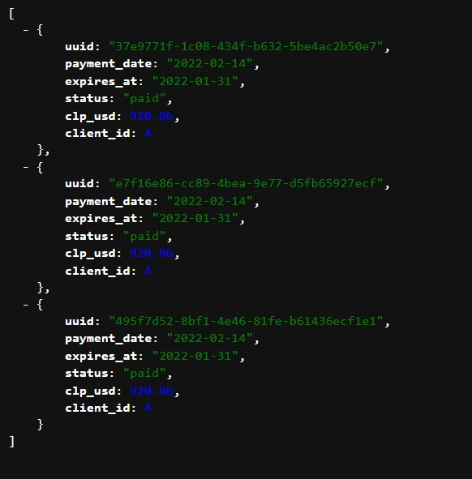

# Laravel Payments & Clients

Application to manage payments and clients.

`GET /api/payments/4`



# Requirements

- Laravel Framework version `9.19`.
- PHP version `8.1.4`.

# Installing

1. Installing the php dependencies.

```bash
composer install
```

2. Copy the `.env.example` file and save it as `.env`.

3. Set the `APP_KEY` value in your `.env` file.

```bash
php artisan key:generate
```

4. Run the migrations and seeders. There is a seeder to fill the table of fake clients.

```bash
php artisan migrate --seed
```

5. Set the username and password to use mailtrap in your `.env` file.

```bash
...
MAIL_USERNAME="your-username"
MAIL_PASSWORD="your-password"
...
```

6. Process the "payment" queue.


```bash
php artisan queue:work --queue=payment
```

7. It is recommended to run to list the failed jobs

```bash
php artisan queue:failed
```

# Endpoints

- `GET /api/clients`

- `GET /api/payments/{id}`

- `POST /api/payments`

    Required fields
    - payment_date: Date in the format: Y-m-d
    - expires_at: Date in the format: Y-m-d
    - client_id: Id of a valid client. For example: 1 to 5.

    Note:
    Save the payment details with pending status.
    Add the payment to the "payment" queue to process it.
    Raise an event to send an email with the payment notification.

# Important files

## Models
- `\app\Models\Api\Client`
- `\app\Models\Api\Payment`
- `\app\Models\Api\Dollar`

## Views
- `resources\Views\Emails\show`

## Controllers
- `\app\Api\PaymentController`
- `\app\Api\ClientController`

## Jobs
- `app\Jobs\ProcessPayment`

## Events
- `\app\Events\PaymentCreated`

## Listeners
- `\app\Listeners\PaymentNotification`

## Factories
- `\database\Factories\Api\ClientFactory`

## Observers
- `\app\Observers\Api\PaymentObserver`

## Enums
- `\app\Enums\PaymentStatus`

## Services
- `\app\Services\DollarService`

## Resources
- `app\Http\Resources\PaymentResource`

## Credits

Rafael Delgado. [delgadorafael2011@gmail.com](mail:delgadorafael2011@gmail.com)
